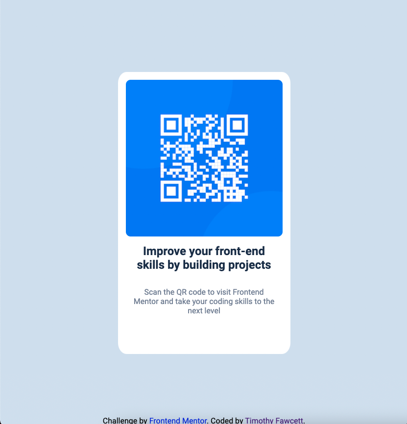

# Frontend Mentor - QR code component solution

This is a solution to the [QR code component challenge on Frontend Mentor](https://www.frontendmentor.io/challenges/qr-code-component-iux_sIO_H). Frontend Mentor challenges help you improve your coding skills by building realistic projects. 

## Table of contents

- [Overview](#overview)
  - [Screenshot](#screenshot)
  - [Links](#links)
- [My process](#my-process)
  - [Built with](#built-with)
  - [What I learned](#what-i-learned)
  - [Continued development](#continued-development)
  - [Useful resources](#useful-resources)
- [Author](#author)
- [Acknowledgments](#acknowledgments)


## Overview
This is my first attempt at a Front End Mentor challenge. Really looking forward to getting some feedback on how I can improve my code.


### Screenshot




### Links

- Solution URL: [Add solution URL here](https://your-solution-url.com)
- Live Site URL: [Add live site URL here](https://your-live-site-url.com)

## My process

I began with the html, then focused on the layout(getting the card in the middle was a little challenging). Then finished with adding the fonts 

### Built with

- Basic HTML5 and CSS


### What I learned

The first place I got stuck was getting the card positioned in the center of the screen. I found this solution on stack overflow which solved the problem.

```CSS
  /* Center the card */
    display: flex;
    justify-content: center;
    align-items: center;
    text-align: center;
    min-height: 100vh;
```

The other issue I had toward the end was a slight gap in the border-bottom around the qr-code image, this was fixed with;

```CSS
  display: flex
```

I also had to play around with with the corner radius a little bit. took a a bit of searching to find;

```CSS
    border-radius: 5% / 4%;
```

### Continued development

Visaully it looks fine but I hope to get some feedback on how to improve my code

### Useful resources

<!-- center card -->
https://stackoverflow.com/questions/31217268/center-div-on-the-middle-of-screen

<!-- Border Radius -->
https://www.youtube.com/watch?v=uUX0RJLtNog


## Author

Timothy Fawcett

- Frontend Mentor - [@timbosTours]
- Twitter - [@timbosTours](https://www.twitter.com/timbosTours)


## Acknowledgments

I would like to shout out John Smilga's youtube chanel Coding addict:

https://www.youtube.com/c/CodingAddict


